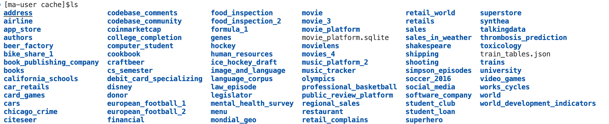

<div align="center">

# The Choice of Divergence: A Neglected Key to Mitigating Diversity Collapse in Reinforcement Learning with Verifiable Reward


</div>


# ✨Getting started


## Data Prepared
This repo is forked from [verl](https://github.com/volcengine/verl). 
For SQL tasks, you need to load the databases. Please download the bird train and dev databases from [bird bench](https://bird-bench.github.io/), spider dev databases from [spider](https://drive.google.com/file/d/1403EGqzIDoHMdQF4c9Bkyl7dZLZ5Wt6J/view?usp=sharing). Then copy the databases to your local dir `/cache/`. Your /cache/ directory should look like the image below.


Our data is split into three parts:

### 1. Original Training Data
* `data/sql/bird_train.parquet`
---
### 2. Test Sets
* `data/sql/spider_dev.parquet`
* `data/sql/bird_dev.parquet`
---
### 3. Pre-Sampling Stage Data
This is our extra collected training data, referred to as $\mathcal{D}_{\text{exp}}$ and $\mathcal{D}_{\text{pef}}$ in the paper. You can find it in the `data/sql/llama3.1-8b/` directory.

## Installation
You can install dependencies by running the following commands:
```
pip install requirements.txt
```

## Evaluation

We launch a server for evaluation using the following code. 
```
cd your_path
python rl/scorer/scorer_server_without_ray.py -c ./rl/scorer/sql.yaml
```
Then, evaluation is performed via the IP address and port. For an implementation reference, please see the code in `verl/utils/reward_score/sql.py`.

## Training
Notes: Please remember set your `SWANLAB_API_KEY` or `WANDB_API_KEY`. All of our scripts are based on multi-machine deployment. We've mounted the evaluation server on non-Rank 0 machines to reduce cluster load. If you only have a single machine, please launch the evaluation server separately.
### Pre-Sampling Stage
#### For the llama-sql experiment, you can skip this step and directly use the data in `data/llama3.1-8b/`.
For DPH-RL, you need to split a complete dataset into two sub-datasets by performing a correct-ness check k times. This requires the following steps:

```
bash scripts/llama/offline_sampling.sh sampling
```
This script samples the training data eight times and saves the data by default to `$PROJECT_DIR/data/sql/llama3.1-8b/generate_data/0.jsonl`.

Next, use 
```
python ./data/sql/process_data/exact_correct_id.py
```
it split the data into `data/sql/llama3.1-8b/train_wrong.parquet` and `data/sql/llama3.1-8b/train_correct.parquet`.

To facilitate further exploration, we first generated data in the train format from `data/sql/llama3.1-8b/train_correct.parquet`. We sampled each data point only once, and saved the correct data to `$PROJECT_DIR/data/sql/llama3.1-8b/8b_llama3.1_all_right.pt`. Please use 
```
bash scripts/llama/get_correct_data_tensor.sh
```
Now, you can directly load this .pt file for model training. The `actor_rollout_ref.actor.generate_sft` parameter can be used to determine whether to sample SFT data.

### DPH-RL
You can implement different methods by directly calling the corresponding scripts in `scripts/llama`. The **`sft_loss_mode`** and **`sft_loss_coeff`** parameters are used to select the specific method and adjust hyperparameters.

The following table outlines the key considerations:
default set `use_kl_loss=False`
| `sft_loss_mode` | Description | Additional Settings | `sft_loss_coeff` |
| :--- | :--- | :--- | :--- |
| **forward** |**Forward KL** |None | 0.01~0.05|
| **js** | **The JS definition**|  `use_kl_loss=True` | 0.05~0.2|
| **js_low_var** | **The JS Generator**|  `use_kl_loss=False` | 0.05~0.2|
| **reverse_kl** | **Reverse KL**|  `data.sft_files=None`<br> `data.sft_pt=None` | 0.01~0.05|
| **alpha** | **$\alpha$ divergence** |  `data.sft_files=None`<br> `data.sft_pt=None` | 0.01~0.05|

